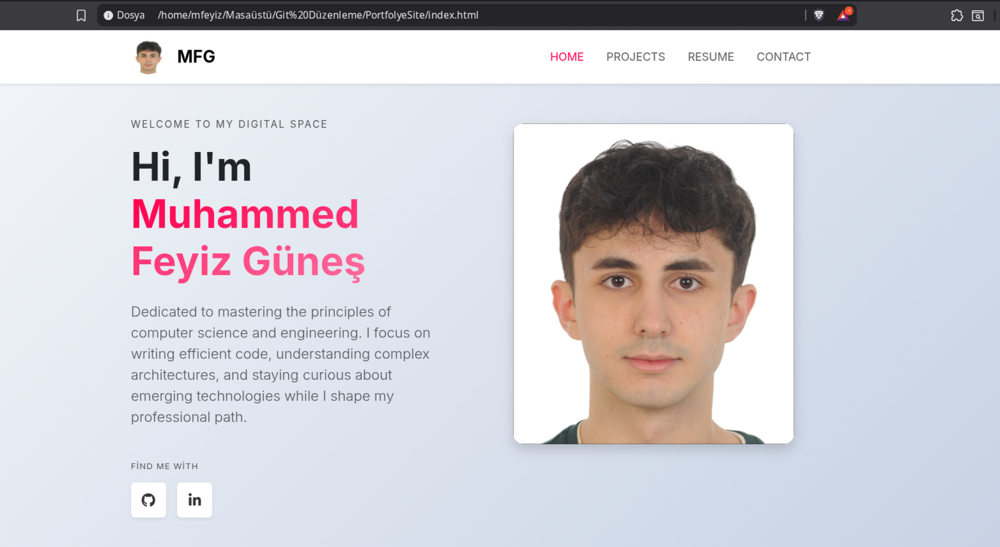
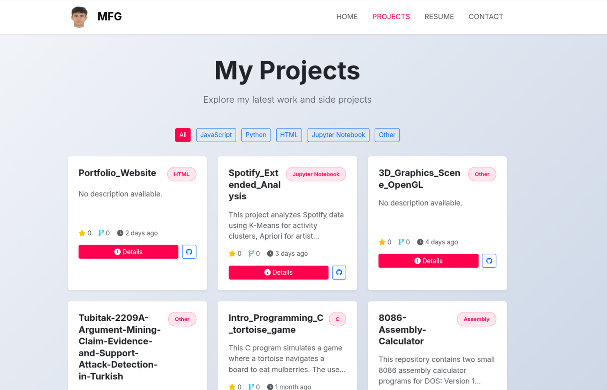
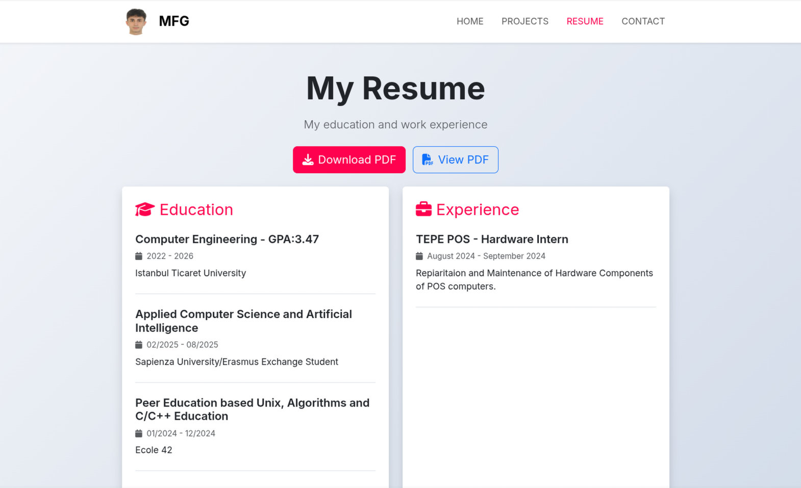
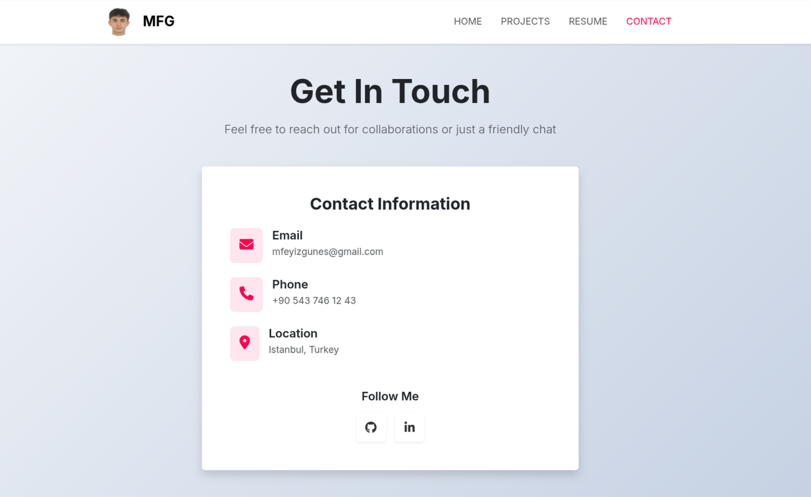

# Portfolio Website - Muhammed Feyiz Güneş

A modern and responsive personal portfolio website built with Bootstrap 5 and vanilla JavaScript.



## 🌟 Features

- **Responsive Design**: Perfect display on all devices
- **Dynamic Projects**: Automatic project listing via GitHub API
- **Modern UI/UX**: Bootstrap 5 and Font Awesome icons
- **Fast & Lightweight**: Optimized performance
- **SEO Friendly**: Optimized for search engines

## 📸 Screenshots

### Home Page


### Projects Page


### Resume Page


### Contact Page


## 🛠️ Technologies

- **HTML5**: Semantic markup
- **CSS3**: Custom styling and animations
- **JavaScript (ES6+)**: Dynamic content management
- **Bootstrap 5.3.2**: Responsive framework
- **Font Awesome 6.4.0**: Icons
- **GitHub API**: Fetching project data

## 📁 Project Structure

```
PortfolyeSite/
├── index.html              # Home page
├── projects.html           # Projects page
├── resume.html            # Resume page
├── contact.html           # Contact page
├── style_portfolio.css    # Main stylesheet
├── projects.js            # JavaScript for projects
├── script_portfolio.js    # General JavaScript
├── photo.jpg              # Profile photo
├── CNAME                  # Domain configuration
├── screenshots/           # Screenshots
└── README.md              # This file
```

## 🚀 Installation

1. **Clone the repository**
```bash
git clone https://github.com/mfeyiz/PortfolyeSite.git "directory_name"
cd "directory_name"
```

2. **Open in browser**
```bash
# Linux/Mac
open index.html

# Windows
start index.html
```

Or use a local server:
```bash
# Python 3
python -m http.server 8000

# Node.js (http-server)
npx http-server
```

3. **View in browser**
```
http://localhost:8000
```

## 🔧 Customization

### Update Personal Information

1. **GitHub Username**: Change the `username` variable in [projects.js](projects.js#L2)
```javascript
const username = 'your-github-username';
```

2. **Profile Photo**: Replace `photo.jpg` with your own photo

3. **Contact Information**: Update email and social media links in [contact.html](contact.html)

4. **Resume File**: Replace `cv_muhammedfeyizgunes.pdf` with your own CV

## 📱 Responsive Breakpoints

- **Desktop**: 992px and above
- **Tablet**: 768px - 991px
- **Mobile**: 767px and below

## 🌐 Live Demo

Live site: [https://muhammedfeyizgunes.com](https://muhammedfeyizgunes.com)

## 📝 Pages

### 1. Home Page (index.html)
- Welcome message
- Brief introduction
- Social media links
- Profile photo

### 2. Projects (projects.html)
- Automatic GitHub projects listing
- Language-based filtering
- Project details modal
- Star and fork counts
- Last update timestamps

### 3. Resume (resume.html)
- CV viewer (PDF)
- CV download
- Education information
- Work experience
- Skills

### 4. Contact (contact.html)
- Email address
- Phone number
- Social media links
- Location information

## 🎨 Design Features

- **Gradient Background**: Modern gradient effects
- **Smooth Scrolling**: Smooth page transitions
- **Hover Effects**: Interactive hover animations
- **Shadow Effects**: Depth-adding shadow effects
- **Custom Scrollbar**: Customized scrollbar

## 🔍 SEO Optimization

- Meta tags
- Semantic HTML
- Alt text for images
- Structured data
- Fast loading times

## 📦 Dependencies

All dependencies are loaded via CDN, no additional installation required:

- Bootstrap 5.3.2
- Font Awesome 6.4.0
- Google Fonts (Inter)

## 👤 Contact

**Muhammed Feyiz Güneş**

- GitHub: [@mfeyiz](https://github.com/mfeyiz)
- LinkedIn: [@mfeyizgunes](https://www.linkedin.com/in/mfeyizgunes/)
- Website: [muhammedfeyizgunes.com](https://muhammedfeyizgunes.com)
